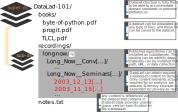

.. _nest:

Dataset nesting
---------------

Without noticing, the previous section demonstrated another core principle
and feature of DataLad datasets: *Nesting*.

Within DataLad datasets one can *nest* other DataLad
datasets arbitrarily deep. We for example just installed one dataset, the
``longnow`` podcast, *into* another dataset, the ``DataLad-101`` dataset.
This does not seem particularly spectacular --
after all, any directory on a filesystem can have other directories inside of it.

The possibility for nested Datasets, however, is one of many advantages
DataLad datasets have:

One aspect of nested datasets is that any lower-level DataLad dataset
(the *subdataset*) has a stand-alone
history. The top-level DataLad dataset (the *superdataset*) only stores
*which version* of the subdataset is currently used.

Let's dive into that.
Remember how we had to navigate into ``recordings/longnow`` to see the history,
and how this history was completely independent of the ``DataLad-101``
superdataset history? This was the subdatasets own history.

But now let's also check out how the *superdatasets* (``DataLad-101``) history
looks like after the installation of a subdataset. To do this, make sure you are
*outside* of the subdataset ``longnow`` (note that the first commit is our recent
addition to ``notes.txt``, so we'll look at the second most recent commit in
this excerpt).

.. runrecord:: _examples/DL-101-106-1
   :language: console
   :workdir: dl-101/DataLad-101
   :lines: 1, 19-42
   :emphasize-lines: 25
   :realcommand: git log -p

   $ git log -p

We have highlighted the important part of this rather long commit summary.
Note that you can not see any ``.mp3``\s being added to the dataset,
as was previously the case when we ``datalad save``\ed PDFs that we
downloaded into ``books/``. Instead,
DataLad stores what it calls a *subproject commit* of the subdataset.
The cryptic character sequence in this line is the checksum we have briefly
mentioned before, and it is
how DataLad internally identifies files and changes to files. Exactly this
checksum is what describes the state of the subdataset.

This highlights a different aspect as well: Note that the ``longnow`` dataset
is a completely independent, standalone dataset that was once created and
published. Nesting allows for a modular re-use of any other DataLad dataset,
and this re-use is possible and simple precisely because all of the information
is kept within a (sub)dataset.

Navigate back into ``longnow`` and try to find the highlighted hash in the
subdatasets history:

.. runrecord:: _examples/DL-101-106-2
   :language: console
   :workdir: dl-101/DataLad-101
   :emphasize-lines: 3

   $ cd recordings/longnow
   $ git log --oneline

We can see that it is the most recent commit hash of the subdataset
(albeit we can see only the first seven characters here -- a ``git log``
would show you the full hash).
This is what is meant by "the top-level DataLad dataset (the *superdataset*) only stores
*which version* of the subdataset is currently used".

Importantly, once we learn how to make use of the history of a dataset,
we can set subdatasets to previous states, or *update* them.

In the upcoming sections, we'll experience the perks of dataset nesting
frequently, and everything that might seem vague at this point will become
clearer. To conclude this demonstration,
the figure below illustrates the current state of the dataset
and nesting schematically:

Thus, without being consciously aware of it, by taking advantage of dataset
nesting, we took a dataset ``longnow`` and installed it as a
subdataset within the superdataset  ``DataLad-101``.
