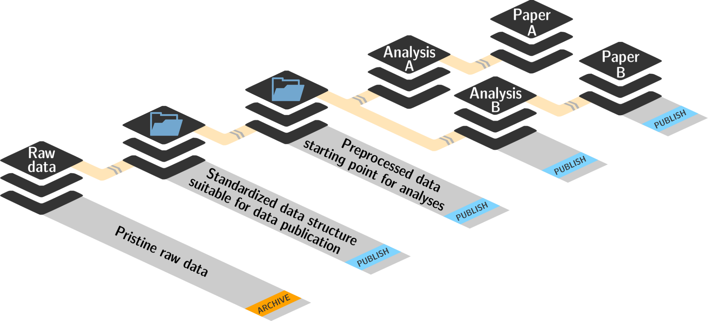
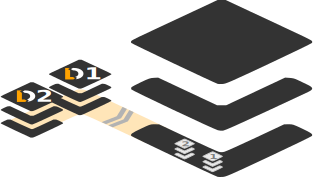
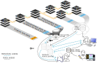

.. _yoda:

YODA: Best practices for data analyses in a dataset
---------------------------------------------------

The last requirement for the midterm projects reads "needs to comply to the
YODA principles".
"What are the YODA principles?" you ask, as you have never heard of this
before.
"The topic of today's lecture: Organizational principles of data
analyses in DataLad datasets. This lecture will show you the basic
principles behind creating, sharing, and publishing reproducible,
understandable, and open data analysis projects with DataLad."

The starting point...
^^^^^^^^^^^^^^^^^^^^^

Data analyses projects are very common, both in science and industry.
But it can be very difficult to produce a reproducible, let alone only
*comprehensible* data analysis project.
Many data analysis projects do not start out with
a stringent organization, or fail to keep the structural organization of a
directory intact as the project develops. Often, this can be due to not
version-controlling analysis projects. In these cases, a project will quickly end up
with many
`almost-identical scripts suffixed with "_version_xyz" <http://phdcomics.com/comics/archive.php?comicid=1531>`_,
or a chaotic results structure split between various directories with names
such as ``results/``, ``results_August19/``, ``results_revision/`` and
``now_with_nicer_plots/``. Something like this for example is a very
common shape a data science project may take after a while:

.. code-block:: bash

    ├── code/
    │   ├── code_final/
    │   │   ├── final_2/
    │   │   │   ├── main_script_fixed.py
    │   │   │   └──takethisscriptformostthingsnow.py
    │   │   ├── utils_new.py
    │   │   ├── main_script.py
    │   │   ├── utils_new.py
    │   │   ├── utils_2.py
    │   │   └── main_analysis_newparameters.py
    │   └── main_script_DONTUSE.py
    ├── data/
    │   ├── data_updated/
    │   │    └── dataset1/
    │   │        ├── datafile_a
    │   │        └── [...]
    │   ├── dataset1/
    │   │   ├── datafile_a
    │   │   └── [...]
    │   ├── outputs/
    │   │   ├── figures/
    │   │   │   ├── figures_new.py
    │   │   │   └── figures_final_forreal.py
    │   │   ├── important_results/
    │   │   │   └── [...]
    │   │   ├── random_results_file.tsv
    │   │   ├── results_for_paper/
    │   │   │   └── [...]
    │   │   ├── results_for_paper_revised/
    │   │   │   └── [...]
    │   │   └── results_new_data/
    │   │   │   └── [...]
    │   ├── random_results_file.tsv
    │   ├── random_results_file_v2.tsv

    [...]

All data analysis endeavours in directories like this *can* work, for a while,
if there is a person who knows the project well, and works on it all the time.
But it inevitably will get messy once anyone tries to collaborate on a project
like this, or simply goes on a two-week vacation and forgets whether
the function in ``main_analysis_newparameters.py`` or the one in
``takethisscriptformostthingsnow.py`` was the one that created a particular figure.

But even if a project has an intuitive structure, and is even version
controlled, in many cases an analysis script will stop working, or maybe worse,
will produce different results, because the software and tools used to
conduct the analysis in the first place got an update. This update may have
come with API changes that made functions stop working, or work differently
than before.
In the same vein, recomputing an analysis project on a different machine than
the one the analysis was developed on can fail if the necessary
software in the required versions is not installed or available on this new machine.
The analysis might depend on software that runs on a Linux machine, but the project
was shared with a Windows user. The environment during analysis development used
Python 2, but on the new system has only Python 3 installed. Or one of the dependent
libraries needs to be in version X, but is installed as version Y.

The YODA principles are a clear set of organizational standards for
datasets used for data analysis projects that aim to overcome issues like the
ones outlined above. The name stands for
"YODAs Organigram on Data Analysis" [#f1]_. The principles outlined
in YODA set simple rules for directory names and structures, best-practices for
version-controlling dataset elements and analyses, facilitate
usage of tools to improve the reproducibility and accountability
of data analysis projects, and make collaboration easier.
They are summarized in three base principles, that translate to both
dataset structures and best practices regarding the analysis:

- **P1:** One thing, one dataset

- **P2:** Record where you got it from, and where it is now

- **P3:** Record what you did to it, and with what

Let's go through them one by one:

P1: One thing, one dataset
^^^^^^^^^^^^^^^^^^^^^^^^^^

Whenever a particular collection of files could be useful in more
than one context, put them in their own DataLad dataset.
In the broadest sense, this means to structure your study elements (data, code,
computational environments, results, ...) in modular components. For example:

- Store **input data** for an analysis in a dedicated ``inputs/`` subdataset.
  Don't mix raw data, data that is already structured following community
  guidelines of the given field, or preprocessed data, but also keep
  these different types of input data as modular components. And if your analysis
  relies on two or more data collections, these collections should each be a
  standalone subdataset.

- Store scripts or **code** used for the analysis of data in a dedicated ``code/``
  directory, outside of the data component of the dataset.

- Collect results of an analysis in a dedicated ``outputs/`` directory, and
  leave the input data of an analysis untouched by your computations.

- Include a place for complete **execution environments**, for example
  `singularity images <https://singularity.lbl.gov/>`_ or
  `docker containers <https://www.docker.com/get-started>`_ [#f2]_, in
  the form of an ``envs/`` directory, if relevant for your analysis.

- If you conduct multiple analyses, create a dedicated dataset for each
  analysis.

There are many advantages to this modular way of organizing contents.
Having input data as independent dataset(s) that are not influenced (only
consumed) by an analysis allows does not conflate the data for
an analysis with the results or the code, thus assisting understanding
the project for anyone unfamiliar with it.
Just now you remember helping a friend of yours with an analysis years ago.
It took an hour of one-on-one guidance to understand the relationships between
vaguely named files in an analysis project that lived inside a single directory.
Thinking about this mess still makes you roll your eyes. From this aspect
alone you therefore find it useful to adopt a modular structure in
your analysis project.
But more than just structure, this organization aids modular reuse or
publication of pure data datasets. It is usually costly to collect data,
and economically unfeasible to keep it locked in a drawer, -- or behind
complexities of data retrieval or difficulties in understanding the data.
Conducting several projects on the same dataset or sharing it is easy,
if the dataset is a DataLad dataset that can be installed
and retrieved on demand, and is kept clean from everything that is not
part of this data component.

P2: Record where you got it from, and where it is now
^^^^^^^^^^^^^^^^^^^^^^^^^^^^^^^^^^^^^^^^^^^^^^^^^^^^^

Its good to have data, but its even better if you and anyone you
collaborate with can find out where the data came from, or how it
is dependent on or linked to other data. Therefore, this principle
means to make sure to attach this information to the components of
your data analysis project.
Luckily, this is a no-brainer with DataLad. Installing a
subdataset with data, or anything else? Thanks to
:command:`datalad install`, information on the source of these datasets
is stored, and you can even update from those sources. Downloading a
file, for example code from Github? With :command:`datalad download-url`
(introduced in section :ref:`sibling`) all of it is safely recorded
in your dataset's history. Add anything to your dataset, from simple
incremental coding progress in your analysis scripts up to files that
a colleague sent you via email? A plain :command:`datalad save` with a
helpful commit message goes a very long way on its own already.

One core aspect of this principle is linking between re-usable data
resource units -- or in plain words: DataLad datasets containing
pure data.

This part of this principle we be absolutely obvious to you because you already
know about installing and nesting datasets within datasets. But
this is everything perfect linkage boils down to: Installing subdatasets.
"Huh, I might just overcome my impostor syndrome if I experience such advanced
reproducible analysis concepts as being obvious", you think with a grin.

But more than linking datasets in a superdataset, linkage also needs to
be established between components of your dataset. Scripts inside of
your ``code/`` directory should point to data not as :term:`absolute path`\s
that would only work on your system, but instead as :term:`relative path`\s
that will work in any shared copy of your dataset. The next section
on DataLads Python API will show concrete examples of this.

Lastly, this principle also includes moving, sharing, and publishing your
datasets or its components.

TODO More here

P3: Record what you did to it, and with what
^^^^^^^^^^^^^^^^^^^^^^^^^^^^^^^^^^^^^^^^^^^^

This last principle boils down to capture how exactly the content of
every file that was not obtained from elsewhere came to be.
The section :ref:`run` already outlined the problem
of associating, say, a result with an input and a script.
:command:`datalad run` however mitigates these difficulties,
and captures the provenance of any output generated with a
``datalad run`` call in the history of the dataset.

With DataLad, one can even go one step further: The command
:command:`datalad containers-run` that will be introduced in
a later part of the book, performs a command execution within
a configured containerized environment. Thus, not only inputs,
outputs, and command, but also the software environment are captured
as provenance.

- talk about datalad run
- capture provenance

This might be the place for the computational environments.....

#. If The (raw) **data** for the analysis project (structured following community
   guidelines of the given field) is stored as an independent component of
   the dataset (ideally, as one or more subdatasets).
   These data should live in an ``inputs/`` directory.

#. Scripts or **code** used for the analysis of the data is stored in a dedicated
   ``code/`` directory, outside of the data component of the dataset.

   #. Within ``code/``, it is best practice to add **tests** for the code. These tests can be
      run to check whether the code still works [#f2]_.

   #. It is even better to further use automated computing, for example
      `continuous integration (CI) systems <https://en.wikipedia.org/wiki/Continuous_integration>`_,
      to test the functionality of your functions and scripts automatically [#f3]_.
      If relevant, the setup for continuous integration frameworks (such as
      `Travis <https://travis-ci.org>`_) lives outside of ``code/``,
      in a dedicated ``ci/`` directory.

#. The **results** of an analysis should be kept in a dedicated ``outputs/``
   directory in the dataset, away from the ``inputs/`` the results were
   derived from.

#. Include **documents for fellow humans**: Notes in a README.md or a HOWTO.md,
   the scientific paper you wrote about your analysis, or even proper
   documentation (for example using  in a dedicated ``docs/`` directory. Within these documents,
   include all relevant metadata for your analysis. If you are
   conducting a scientific study, this might be authorship, funding,
   change log, etc.

#. Include a place for complete **execution environments**, for example
   `singularity images <https://singularity.lbl.gov/>`_ or
   `docker containers <https://www.docker.com/get-started>`_ [#f4]_, in
   the form of an ``envs/`` directory, if relevant for your analysis.

This directory structure has all of the components the YODA principles talk
about:

.. code-block:: bash

    ├── ci/
    │   └── .travis.yml
    ├── code/
    │   ├── tests/
    │   │   └── test_myscript.py
    │   └── myscript.py
    ├── docs
    │   ├── build/
    │   └── source/
    ├── envs
    │   └── Singularity
    ├── inputs/
    │   └─── data/
    │       ├── dataset1/
    │       │   └── datafile_a
    │       └── dataset2/
    │           └── datafile_a
    ├── outputs/
    │   └── important_results/
    │       └── figures/
    ├── tests/
    ├── CHANGELOG.md
    ├── HOWTO.md
    └── README.md

These standards are not complex -- quite the opposite, they are very
intuitive. They structure essential components of a data analysis project --
data, code, computational environments, and lastly also the results --
in a modular and practical way.

There are many advantages to the way this precise way of organizing contents.
Having input data as independent dataset(s) that are not influenced (only
consumed) by an analysis allows for a modular reuse of pure data datasets,
and does not conflate the data of an analysis with the results or the code.

Keeping code within an independent, version-controlled directory, but as a part
of the analysis dataset, makes sharing code easy and transparent. Moreover,
with the data as subdatasets, data and code can be automatically shared together.

Including the computational environment into an analysis dataset encapsulates
software and software versions, and thus prevents re-computation failures
(or sudden differences in the results) once
software is updated, and software conflicts arising on different machines
than the one the analysis was originally conducted on.

Having all of these components as part of a DataLad dataset allows version
controlling all pieces within the analysis regardless of their size, and
generates provenance for everything.

.. rubric:: Footnotes

.. [#f1] "Why does the acronym contain itself?" you ask confused.
         "That's because it's a `recursive acronym <https://en.wikipedia.org/wiki/Recursive_acronym>`_,
         where the first letter stands recursively for the whole acronym." you get in response.
         "This is a reference to the recursiveness within a DataLad dataset -- all principles
         apply recursively to all the subdatasets a dataset has."
         "And what does all of this have to do with Yoda?" you ask mildly amused.
         "Oh, well. That's just because the DataLad team is full of geeks."

.. [#f2] If you want to learn more about Docker and Singularity, or general information
         about containerized computational environments for reproducible data science,
         check out `this section <https://the-turing-way.netlify.com/reproducible_environments/06/containers#Containers_section>`_
         in the wonderful book `The Turing Way <https://the-turing-way.netlify.com/introduction/introduction>`_,
         a comprehensive guide to reproducible data science.

.. [#f3] If writing tests for analysis scripts is a new idea for you, but
         you want to learn more, check out
         `this excellent chapter on testing <https://the-turing-way.netlify.com/testing/testing.html#Acceptance_testing>`_
         in the book `The Turing Way <https://the-turing-way.netlify.com/introduction/introduction>`_,
         .

.. [#f4] The chapter mentioned in [#f2]_ is also a great resource to
         learn more about continous integration.

