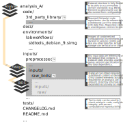

Basic DataLad Magic: Dataset nesting
------------------------------------

Without noticing, the previous section demonstrated another core principle
and feature of DataLad datasets: *Nesting*.

Within DataLad datasets one can *nest* other DataLad
datasets arbitralily deep. We for example just installed one dataset, the
machine learning books, *into* another dataset, the ``DataLad-101`` dataset.
This does not seem particulary spectacular --
after all, any directory on a filesystem can have other directories inside of it.

The possibility for nested Datasets, however, is one of many advantages
DataLad datasets have:

One aspect of nested datasets is that any lower-level DataLad dataset
(the *subdataset*) has a stand-alone
history. The top-level DataLad dataset (the *superdataset*) only stores
*which version* of the subdataset is currently used.

Let's dive into that.
Remember how we had to navigate into ``books/ml-books`` to see the history,
and how this history was completely independent of the ``DataLad-101``
superdataset history? This was the subdatasets own history.

But now let's also check out how the *superdatasets* (``DataLad-101``) history
looks like after the installation of a subdataset. To do this, make sure you are
*outside* of ``ml-books``.

.. runrecord:: _examples/DL-101-6-1
   :language: console
   :workdir: dl-101/DataLad-101
   :lines: 1-24
   :emphasize-lines: 24
   :realcommand: git log -p

   $ git log -p

We have highlighted the important part of this rather long commit summary.
Note that you can not see any PDFs being added to the dataset, as was previously
the case when we ``datalad save``\ed PDFs that we downloaded. Instead,
DataLad stores what it calls a *subproject commit* of the subdataset.
The cryptic character sequence in this line is the checksum we have briefly
mentioned before, and it is
how DataLad internally identifies files and changes to files. Exactly this
checksum is what describes the state of the subdatset.

Navigate into ``ml-books`` and try to find the highlighted hash in the
subdatasets history:

.. runrecord:: _examples/DL-101-6-2
   :language: console
   :workdir: dl-101/DataLad-101
   :emphasize-lines: 3

   $ cd books/ml-books
   $ git log --oneline

We can see that it is the most recent commit hash of the subdataset
(albeit we can see only the first seven characters here -- a ``git log``
would show you the full hash).
This is what is meant by "the top-level DataLad dataset (the *superdataset*) only stores
*which version* of the subdataset is currently used".

Importantly, once we learn how to make use of the history of a dataset,
we can set subdatasets to previous states, or *update* them.
Such an approach is especially useful for reproducible analyses.
If one uses external data, this data can be installed as a subdataset.
Should the data get extended or changed, or exist in different versions,
its subdataset can be updated to include the changes easily, or set to the
state in history which contains the required version of the data.
All of this is done without "polluting" the superdatasets history with
potentially hundrets of file changes, but a simple subproject commit change.
More detailed examples of this can be found in later parts of the Basics
or in the use cases in the last
section (for example in :ref:`remodnav`).

The figure below illustrates dataset nesting schematically:

Thus, without being consciously aware of it, by taking advantage of dataset
nesting, we took a dataset ``ml-books`` and installed it as a
subdataset within the superdataset  ``DataLad-101``.