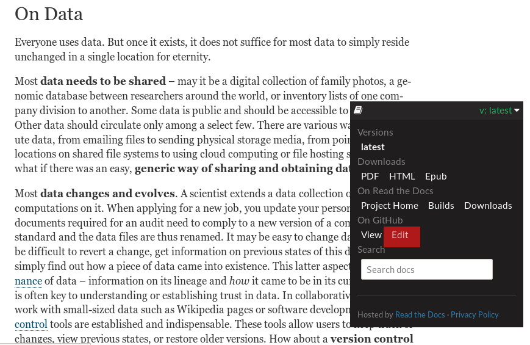

.. _contribute:

Contributing
------------

Thanks for being curious about contributing!
We greatly appreciate and welcome contributions to this book, be it in the form
of an `issue <https://github.com/datalad-handbook/book/issues/new>`_, a pull request,
or a discussion you had with anyone on the team via a non-Github communication channel!
To find out how we acknowledge contributions, please read the paragraph
:ref:`acknowledge` at the bottom of
this page.

If you are considering doing a pull request: Great! Every contribution is valuable,
from fixing typos to writing full chapters.
The steps below outline how the book "works". It is recommended to also create an issue
to discuss changes or additions you plan to make in advance.

Software setup
""""""""""""""

Depending on the size of your contribution, you may want to be able to build the book
locally to test and preview your changes. If you are fixing typos, tweak the
language, or rewrite a paragraph or two, this should not be necessary, and you can safely
skip this paragraph and instead take a look into the paragraph
:ref:`easy`.
If you want to be able to build the book locally, though, please follow these instructions:

-  datalad install the repository recursively. This ensures that dependent subdatasets are installed as well

.. code-block:: bash

   $ datalad install -r https://github.com/datalad-handbook/book.git

- optional, but recommended: Create a virtual environment

.. code-block:: bash

   $ virtualenv --python=python3 ~/env/handbook
   $ . ~/env/handbook/bin/activate

- install the requirements and a custom Python helper for the handbook

.. code-block:: bash

   # navigate into the installed dataset
   $ cd book
   # install required software
   $ pip install -r requirements.txt
   $ pip install -e .

- install ``librsvg2-bin`` (a tool to render ``.svgs``) with your package manager

.. code-block:: bash

   $ sudo apt-get install librsvg2-bin

The code examples that need to be executed to build the book (see also the paragraph "Code" in
:ref:`directive` to learn more about this) are executed inside of
the directory ``/home/me``. This means that *this directory needs to exist* on your machine.
Essentially, ``/home/me`` is a mock directory set up in order to have identical paths
in code snippets regardless of the machine the book is build on: Else, code snippets
created on one machine might have the path ``/home/adina``, and others created on
a second machine ``/home/mih``, for example, leading to some potential confusion for readers.
Therefore, you need to create this directory, and also --
for consistency in the Git logs as well -- a separate, mock Git identity
(we chose `Elena Piscopia <https://en.wikipedia.org/wiki/Elena_Cornaro_Piscopia>`_, the first
woman to receive a PhD -- do not worry, this does not mess with your own Git identity):

.. code-block:: bash

   $ sudo mkdir /home/me
   $ sudo chown $USER:$USER /home/me
   $ HOME=/home/me git config --global user.name "Elena Piscopia"
   $ HOME=/home/me git config --global user.email "elena@example.net"

.. todo::

   remove separate Git identity until https://github.com/datalad/datalad/issues/3750
   is fixed

Once this is configured, you can build the book locally by running ``make`` in the root
of the repository, and open it in your browser, for example with
``firefox docs/_build/html/index.html``.

.. _directive:

Directives and casts
""""""""""""""""""""

If you are writing larger sections that contain code, ``gitusernote``\s, ``findoutmore``\s,
or other special directives, please make sure that you read this paragraph.

The book is build with a number of custom directives. If applicable, please
use them in the same way they are used throughout the book.

**Code:** For code that runs inside a dataset such as ``DataLad-101``,
working directories exist inside of ``/home/me``. The ``DataLad-101``
dataset for example lives in ``/home/me/dl-101``. This comes with the advantage
that code is tested immediately -- if the code snippet contains an error, this error will
be written into the book, and thus prevent faulty commands from being published.
Running code in a working directory will furthermore build up on the existing history
of this dataset, which is very useful if some code relies on working with previously
created content or dataset history. Build code snippets that add to these working directories
by using the ``runrecord`` directive. Commands wrapped in these will write the output
of a command into example files stored inside of the DataLad Handbook repository clone
in ``docs/PART/_examples`` (where ``PART`` is ``basics`` or ``usecases``).
Make sure to name this files according to the following
schema, because they are executed sequentially:
``_examples/DL-101-1<nr-of-section>-1<nr-of-example>``, e.g.,
``_examples/DL-101-101-101`` for the first example in the first section
of the given part.
Here is how a ``runrecord`` directive can look like:

.. code-block:: rst

   .. runrecord:: _examples/DL-101-101-101   # give the path to the resulting file, start with _examples
      :language: console
      :workdir: dl-101/DataLad-101    # specify a working directory here. This translates to /home/me/dl-101/DataLad-101

      # this is a comment
      $ this line will be executed

Afterwards, the resulting example files need to be committed into Git. To clear existing
examples in ``docs/PART/_examples`` and the mock directories in ``/home/me``, run ``make clean`` and
``make clean-examples``.

However, for simple code snippets outside of the narrative of ``DataLad-101``,
simple ``code-block::`` directives are sufficient.

**Other custom directives:** Other custom directives are ``gitusernote``
(for additional Git-related information for Git-users), and ``findoutmore``
(foldable sections that contain content that goes beyond the basics). Make use
of them, if applicable to your contribution.

**Creating code live casts out of runrecord directives**:
The book has the capability to turn code snippets into a script that the tool
`cast_live <https://github.com/datalad/datalad/blob/master/tools/cast_live>`_
can use to cast and execute it in a demonstration shell. This feature is
intended for educational courses and other types of demonstrations. The
following prerequisites exist:

- A snippet only gets added to a cast, if the ``:cast:`` option in the
  ``runrecord`` specifies a filename where to save the cast to (it does not
  need to be an existing file).
- If ``:realcommand:`` options are specified, they will become the executable
  part of the cast. If note, the code snippet in the code-block of the
  ``runrecord`` will become the executable part of the cast.
- An optional ``:notes:`` lets you add "speakernotes" for the cast.
- Casts are produced upon ``make``, but only if the environment variable
  ``CAST_DIR`` is set.
  This should be a path that points to any directory in which casts should be
  created and saved. An invocation could look like this::

     $ CAST_DIR=/home/me/casts make

This is a fully specified ``runrecord``:

.. code-block:: rst

   .. runrecord:: _examples/DL-101-101-101
      :language: console
      :workdir: dl-101/DataLad-101
      :cast: dataset_basics   # name of the cast file (will be created/extended in CAST_DIR)
      :notes: This is an optional speaker note only visible to presenter during the cast

      # this is a comment and will be written to the cast
      $ this line will be executed and written to the cast

**IMPORTANT!** Code snippets will be turned into casts in the order of
execution of ``runrecords``. If you are adding code into an existing cast,
i.e., in between two snippets that get written to the same cast, make sure that
the cast will still run smoothly afterwards!

**Running code live casts from created casts**:
If you have created a cast, you can use the tool ``live_cast`` in ``tools/`` in
the `DataLad Course <https://github.com/datalad-handbook/course>`_ to
execute them::

   ~ course$ tools/cast_live path/to/casts

.. _easy:

Easy pull requests
^^^^^^^^^^^^^^^^^^

The easiest way to do a pull request is within the web-interface that Github
and `readthedocs <https://readthedocs.org>`_ provide. If you visit the rendered
version of the handbook at `handbook.datalad.org <http://handbook.datalad.org/>`_
and click on the small, floating ``v:latest`` element at the lower
right-hand side, the ``Edit`` option will take you straight to an editor that
lets you make your changes and submit a pull request.

         Readthedocs.

   You can find an easy way to submit a pull request right from within the handbook.

But you of course are also welcome to submit a pull request with whichever
other workflow suites you best.

Desired structure of the book
^^^^^^^^^^^^^^^^^^^^^^^^^^^^^

The book consists of three major parts: Introduction, Basics, and Use Cases,
plus an appendix. Purpose and desired content of these parts are outlined
below. When contributing to one of these sections, please make sure that your
contribution stays in the scope of the respective section.

Introduction
""""""""""""

- An introduction to DataLad, and the problems it aims to be a solution for.

- This part is practically free of hands-on content, i.e., no
  instructions, no demos. Instead, it is about concepts, analogies, general
  problems.

- In order to avoid too much of a mental split between a reader's desire to
  learn how to actually do things vs. conceptual information, the introduction
  is purposefully kept short and serves as a narrated table of contents with
  plenty of references to other parts of the book.

Basics
""""""

- This part contains hands-on-style content on skills that are crucial for
  using DataLad productively. Any non-essential information is not in basics,
  but collected in an appendix.

- The order of topics in this part is determined by the order in which they
  become relevant for a novice DataLad user.

- Content should be written in a way that explicitly encourages executing the
  shown commands, up to simple challenges (such as: "find out who the author of
  the first commit in the installed subdataset XY is").

Use Cases
"""""""""

- Topics that do not fit into the introduction or basics parts, but are
  DataLad-centric, go into this part. Ideal content are concrete examples of
  how DataLad's concepts and building blocks can be combined to implement
  a solution to a problem.

- Any chapter is written as a more-or-less self-contained document that can
  make frequent references to introduction and basics, but only few, and more
  general ones to other use cases. This should help with long-term maintenance
  of the content, as the specifics of how to approach a particular use case
  optimally may evolve over time, and cross-references to specific
  functionality might become invalid.

- There is no inherent order in this part, but chapters may be grouped by
  domain, skill-level, or DataLad functionality involved (or combinations of
  those).

- Any content in this part can deviate from the examples and narrative used for
  introduction and basics whenever necessary (e.g., concrete domain specific use
  cases). However, if possible, common example datasets, names, terms should be
  adopted, and the broadest feasible target audience should be assumed. Such
  more generic content should form the early chapters in this part.

- Unless there is reason to deviate, the following structure should be adopted:

  #. Summary/Abstract (no dedicated heading)

  #. *The Challenge*: description what problem will be solved, or which conditions
     are present when DataLad is not used

  #. *The DataLad Approach*: high-level description how DataLad can be used to
     address the problem at hand.

  #. *Step-by-Step*: More detailed illustration on how the "DataLad approach" can
     be implemented, ideally with concrete code examples.

.. _acknowledge:

Acknowledging Contributors
^^^^^^^^^^^^^^^^^^^^^^^^^^

If you have helped this project, we would like to acknowledge your contribution in the
`Github repository <https://github.com/datalad-handbook/book>`_ in our README with
`allcontributors.org <https://allcontributors.org/>`_, and the project's
`.zenodo <https://github.com/datalad-handbook/book/blob/master/.zenodo.json>`_ and
`CONTRIBUTORS.md <https://github.com/datalad-handbook/book/blob/master/CONTRIBUTORS.md>`_
files. The `allcontributors bot <https://github.com/all-contributors>`_ will give credit
for `various types of contributions <https://allcontributors.org/docs/en/emoji-key>`_.
We may ask you to open a PR to add yourself to all of our contributing acknowledgements
or do it ourselves and let you know.
