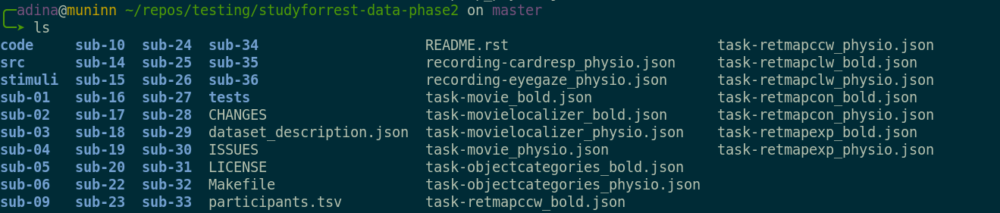
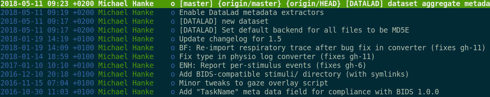
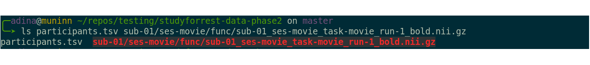
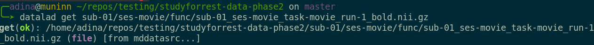

****************
DataLad Datasets
****************

.. note::
   If you like
   learning-by-doing, let us explore together what a DataLad dataset is.
   If you have DataLad set-up, run the following command and follow the
   commands in the screenshots.

   .. code-block:: bash

      datalad install https://github.com/psychoinformatics-de/studyforrest-data-phase2.git

A DataLad dataset is the core data type of DataLad. We will explore the concepts
of it with one public example dataset, the studyforrest phase 2 data (studyforrest.org).
Note that this is just one type and use of a Datalad dataset, and you will find many
more flavors of using DataLad datasets in upcoming chapters.
In this example, I have installed the dataset in ``~/repos/testing``.

Once created, a DataLad dataset looks like any other directory on your filesystem:

However, all files and directories within the DataLad dataset can be
tracked (should you want them to be tracked), regardless of their size.
Large content is tracked in an *annex* that is automatically
created and handled by DataLad. Whether text files or larger files change,
all of these changes can be written to your DataLad datasets history.

.. admonition:: Note for git users:

   A DataLad dataset is a git repository. Large file content in the
   dataset in the annex is tracked with git-annex. An ``ls -a``
   reveals that git is secretly working in the background:

   .. figure:: ../img/DatasetLsLAH2.png
      :alt: Git exists underneath the hood

Users can *create* new DataLad datasets from scratch, or install existing
DataLad datasets from paths, urls, or open-data collections. This makes
sharing and accessing data fast and easy. Moreover, when sharing or installing
a DataLad dataset, all copies also include the datasets history. An installed DataLad
dataset knows the dataset it was installed from, and if changes
in this original DataLad dataset happen, the installed dataset can simply be updated.

You can view the DataLad datasets history with tools of your choice, but we will
get into more detail on the history of a DataLad dataset in later chapters.
The screenshot below is used for illustration purposes and is an exempt
from :term:`tig`.

Dataset content identity and availability information
*****************************************************

Upon installation of a DataLad dataset, DataLad retrieves only (small) metadata
information about the dataset. This exposes the datasets file hierarchy
for exploration, and speeds up the installation of a DataLad dataset
of many TB in size to a few seconds. Just after installation, the dataset is
small in size:

.. figure:: ../img/DatasetSizeBefore.png
   :alt: Dataset size after installation

This is because only small files are present locally (my shell helps me to
determine this with its highlighting features - for shits and giggles, you can try
opening both files). A small ``.tsv`` (1.9K) file exists
locally, but what would be a large, compressed neuroimaging nifti (``.nii.gz``) file
isn't. In this state, one cannot open or work with the nifti file, but you can
explore which files exist without the potentially large download.

The retrieval of the actual, potentially large
file content can happen at any later time for the full dataset or subsets
of files. Lets get the nifti file:

Wasn't this easy?

Dataset Nesting
***************

Within DataLad datasets one can *nest* other DataLad
datasets arbitralily deep. This does not seem particulary spectacular -
after all, any directory on a filesystem can have other directories inside it.
The possibility for nested Datasets, however, is one of many advantages
DataLad datasets have:
Any lower-level DataLad dataset (the *subdataset*) has a stand-alone
history. The top-level DataLad dataset (the *superdataset*) only stores
*which version* of the subdataset is currently used.

By taking advantage of dataset nesting, one can take datasets such as the
studyforrest phase-2 data and install it as a subdataset within a
superdataset containing analysis code and results computed from the
studyforrest data. Should the studyforrest data get extended or changed,
its subdataset can be updated to include the changes easily. More
detailed examples of this can be found in the use cases in the last
section (for example in :ref:`remodnav`).

The figure below illustrates dataset nesting schematically:

.. figure:: ../img/virtual_dirtree.png
   :alt: Virtual directory tree of a nested DataLad dataset

I want to create a dataset myself!
**********************************

Anyone can create, populate, and optionally share a *new* DataLad dataset.
A new DataLad dataset is always created empty, even if the target
directory already contains additional files or directories. After creation,
arbitralily large amounts of data can be added. Once files are added and
saved to the dataset, any changes done to these data files can be saved
to the history.

.. admonition:: Note for git users:

   Creation of datasets relies on the ``git init`` and ``git annex init`` commands.

As already shown, already existing datalad dataset can be simply installed
from a url or path, or from the datalad open-data collection.

.. admonition:: Note

   ``datalad install`` used the ``git clone`` command.

More information
on the creation and installation of datasets will be introduced in later
chapters.

.. todo::

   We might need to address symlinks and the concept of content being stored
   in the object tree, not the file user can see in their directory.