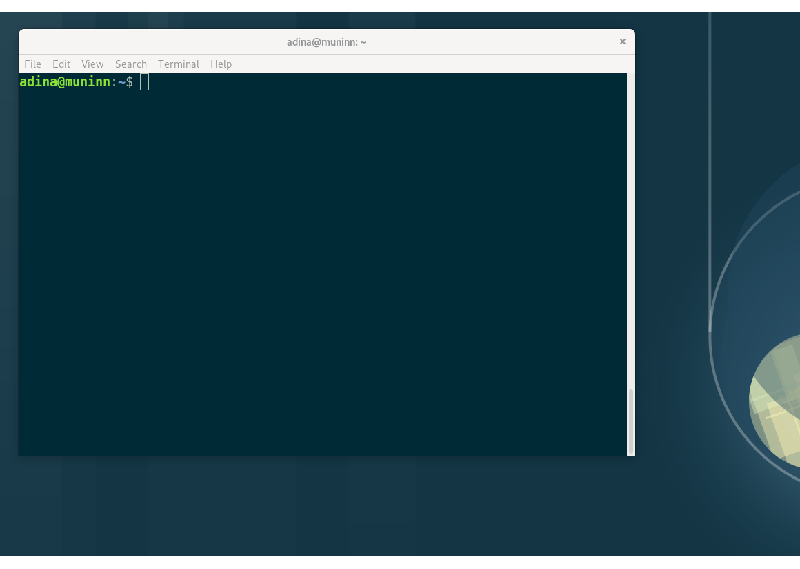

.. _howto:

*********************
General prerequisites
*********************

DataLad uses command-line arguments in a *terminal*. This means that there is no graphical
user interface with buttons to click on, but a set of commands and options users type into
their shell. If you are not used to working with command-line arguments, DataLad can
appear intimidating. Luckily, the set of possible commands is limited, and even without
prior experience with a shell, one can get used to it fairly quickly.

This chapter aims at providing novices with general basics about the shell, common Unix
commands, and some general file system facts.
This chapter is also a place to return to and (re-)read if you come across a
non-DataLad command or principle you want to remind yourself of.
If you are already familiar with the shell and know the difference between an absolute
and a relative path, you can safely skip this chapter and continue to the DataLad Basics.

Almost all of this chapter is based on parts of a wonderful lab documentation
Alex Waite wrote.

The Command Line
================
The shell (sometimes also called a terminal, console, or CLI) is an interactive,
text based interface. If you have used Matlab or IPython, then you are already familiar
with the basics of a command line interface.

   A terminal window in a standard desktop environment.

Command Syntax
==============

Commands are case sensitive and follow the syntax of: ``command [options...] <arguments...>``.
Whenever you see some example code in the code snippets of this book, make sure
that you capitalize exactly as shown if you try it out yourself.
The options modify the behavior of the program, and are usually preceded by ``-`` or ``--``.
In this example

.. runrecord:: _examples/how-to-1
   :language: console
   :workdir: dl-101
   :lines: 1, 5
   :realcommand: dd if=/dev/zero of=output.txt  bs=1M  count=24 && ls -l output.txt

   $ ls -l output.txt

``ls`` is the *command*. The *option* ``-l`` tells ``ls`` to use a long listing format and
thus display more information.
``output.txt`` is the *argument* — the file that ``ls`` is listing.
The difference between options preceded by ``-`` and ``--`` is their length:
Usually, all options starting with a single dash are single letters. Often,
a long, double-dashed option exists for these short options as well. For example,
to list the size of a file in a *human-readable* format, supply the short option
``-h``, or, alternatively, its longer form, ``--human-readable``.

.. runrecord:: _examples/how-to-2
   :language: console
   :workdir: dl-101
   :realcommand: ls -lh output.txt && rm output.txt

   $ ls -lh output.txt    # note that short options can be combined!
   # or alternatively
   $ ls -l --human-readable output.txt

Every command has many of those options (often called "flags") that modify their behavior.
There are too many to even consider memorizing. Remember the ones you use often,
and the rest you will lookup in their documentation or via your favorite search engine.
DataLad commands naturally also come with many options, and in the next chapters
and later examples you will get to see many of them.

Basic Commands
==============
The following commands can appear in our examples or are generally useful to know:
They can help you to *explore and navigate* in your file system (``cd``, ``ls``),
copy, move, or remove files (``cp``, ``mv``, ``rm``), or create new directories
(``mkdir``).

``ls -lah <folder>``
    list the contents of a folder, including hidden files (-a), and all their information (-l);
    print file sizes in human readable units (-h)
``cd <folder>``
    change to another folder
``cp <from> <to>``
    copy a file
``cp -R <from> <to>``
    copy a folder and its contents (-R)
``mv <from> <to>``
    move/rename a file or folder
``rm <file>``
    delete a file
``rm -Rv <folder>``
    delete a folder and its contents (-R) and list each file as it's being deleted (-v)
``mkdir <folder>``
    create a folder
``rmdir <folder>``
    delete an empty folder

The Prompt
==========
When you first login on the command line, you are greeted with "the prompt",
and it will likely look similar to this:

``adina@munnin: ~$``

This says I am the user adina on the machine muninn and I am in the folder ``~``,
which is shorthand for the current user's home folder (in this case ``/home/adina``).

The ``$`` sign indicates that the prompt is interactive and awaiting user input.
In this handbook, we will use ``$`` as a shorthand for the prompt, to allow
the reader to quickly differentiate between lines containing commands vs the
output of those commands.

Paths
=====
Let's say I want to create a new folder in my home folder,
I can run the following command:

.. code-block:: bash

   $ mkdir /home/adina/awesome_datalad_project

And that works. ``/home/adina/awesome_datalad_project`` is what is called an *absolute*
path. Absolute paths *always* start with a ``/``, and define the folder's location
with no ambiguity.

However, much like in spoken language, using someone's full proper name every
time would be exhausting, and thus pronouns are used.

This shorthand is called *relative* paths, because they are defined (wait for it...)
*relative* to your current location on the file system. Relative paths *never* start
with a ``/``.

Unix knows a few shortcuts to refer to file system related directories, and you will
come across them often. Whenever you see a ``.``, ``..``, or ``~`` in a DataLad command,
here is the translation to this cryptic punctuation:

``.``
    the current directory
``..``
    the parent directory
``~``
    the current user's home directory

So, taking the above example again: given that I am in my home (``~``) folder,
the following commands all would create the new folder in the exact same place.

.. code-block:: bash

   mkdir /home/adina/awesome_datalad_project
   mkdir ~/awesome_datalad_project
   mkdir awesome_datalad_project
   mkdir ./awesome_datalad_project

To demonstrate this further, consider the following: In my home directory
``/home/adina`` I have added a folder for my current project,
``awesome_datalad_project/``. Let's take a look at how this folder is organized:

.. code-block:: bash

   $ tree

   └── home
       └── adina
            └── awesome_datalad_project
               ├── aligned
                   ├── code
               └── sub-01
                   └── bold3T
               └── sub-02
                   └── bold3T
               ├── ...
               └── sub-xx
                   └── bold3T
           └── structural
               └── sub-01
                   └── anat
               └── sub-02
                   └── anat
               ├── ...
               └── sub-xx
                   └── anat

Now let's say I want to change from my home directory ``/home/adina`` into the ``code/``
folder of the project. I could use absolute paths:

``cd /home/adina/awesome_datalad_project/aligned/code``

But that is a bit wordy. It is much easier with a relative path:

.. code-block:: bash

   $ cd awesome_datalad_project/aligned/code

Relative to my starting location (``/home/adina``), I navigated into the subfolders.

I can change back to my home directory also with a relative path:

.. code-block:: bash

   $ cd ../../../

The first ``../`` takes me from ``code/`` to its parent ``aligned/``, the
second ``../`` to ``awesome_datalad_project/``, and the last ``../``
back to my home directory ``adina/``.

However, since I want to go back to my home folder, it's much faster to run:

.. code-block:: bash

   $ cd ~

Text Editors
============

Text editors are a crucial tool for any Linux user, but regardless of your operating system,
if you use DataLad, you will occasionally find yourself in your default text editor to write
a :term:`commit message` to describe a change you performed in your DataLad dataset.

Religious wars have been fought over which is "the best" editor. From the smoldering ashes,
this is the breakdown:

``nano``
    Easy to use; medium features. If you do not know which to use, start with this.
``vim``
    Powerful and light; lots of features and many plugins; steep learning curve.
    Two resources to help get the most out of vim are the vimtutor program
    and vimcasts.org. If you accidentally enter ``vim`` unprepared, typing ``:q``
    will get you out of there.
``emacs``
    Powerful; tons of features; written in Lisp; huge ecosystem; advanced learning curve.

Shells
======

Whenever you use the command line on a Unix-based system, you do that in a command-line
interpreter that is referred to as a ``shell``.

The shell is used to start commands and display the output of those commands.
It also comes with its own primitive (yet surprisingly powerful) scripting language.

Many shells exist, though most belong to a family of shells called "Bourne Shells"
that descend from the original ``sh``. This is relevant, because they share (mostly)
a common syntax.

Two common shells are:

``Bash``
    The bourne-again shell (``bash``) is the default shell on many \*nix systems (most Linux distros, MacOS).
``zsh``
    The Z shell (``zsh``) comes with many additional features, the highlights being:
    shared history across running shells, smarter tab-completion, spelling correction, and better theming.

To determine what shell you're in, run the following:

.. code-block:: bash

   $ echo $SHELL
   usr/bin/bash

Tab Completion
==============

One of the best features ever invented is tab completion. Imagine your favorite animal sitting
on your shoulder. Now imagine that animal shouting "TAB!" every time you've typed the first
3 letters of a word. Listen to that animal.

Tab completion autocompletes commands and paths when you press the Tab key.
If there are multiple matching options, pressing Tab twice will list them.

The greatest advantage of tab completion is not increased speed (though that is a nice benefit)
but rather the near elimination of typos — and the resulting reduction of cognitive load.
You can actually focus on the task you're working on, rather than your typing. Tab-completion
will autocomplete a DataLad command, options you give to it, or paths.

For an example of tab-completion with paths, consider the following directory structure:

.. code-block:: bash

   ├── Desktop
   ├── Documents
   │   ├── my_awesome_project
   │   └── my_comics
   │      └── xkcd
   │      │   └── is_it_worth_the_time.png
   ├── Downloads

You're in your home directory, and you want to navigate to your `xkcd <https://xkcd.com/1205/>`_
comic selection in ``Documents/my_comics/xkcd``.
Instead of typing the full path error-free, you can press Tab after the first few letters.
If it is unambiguous, such as ``cd Doc <Tab>``, it will expand to ``cd Documents``.
If there are multiple matching options, such as ``cd Do``, you will be prompted for more letters.
Pressing Tab again will list the matching options (``Documents`` and ``Downloads`` in this case).

.. only:: html

   .. figure:: https://upload.wikimedia.org/wikipedia/commons/a/ad/Command-line-completion-example.gif
      :alt: Tab completion

      A visual example of tab-completion in action:

**That's it -- equipped with the basics of Unix, you are good to go on your DataLad advanture!**
