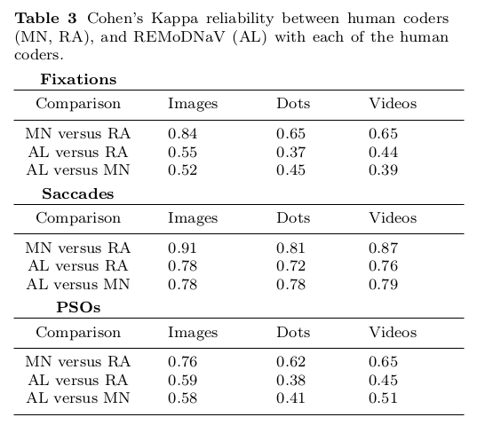

.. _usecase_reproducible_paper:

Writing a reproducible paper
----------------------------

This use case demonstrates how to use nested DataLad datasets to create a fully
reproducible paper by linking

#. (different) DataLad dataset sources with
#. the code needed to compute results and
#. LaTeX files to compile the resulting paper.

The different components each exist in individual DataLad datasets and are
aggregated into a single :term:`DataLad superdataset` complying to the YODA principles
for data analysis projects [#f1]_. The resulting superdataset can be publicly
shared, data can be obtained effortlessly on demand by anyone that has the superdataset,
and results and paper can be generated and recomputed everywhere on demand.

The Challenge
^^^^^^^^^^^^^

Over the past year, Steve worked on the implementation of an algorithm as a software package.
For testing purposes, he used one of his own data collections, and later also included a publicly shared
data collection. After completion, he continued to work on validation analyses to
prove the functionality and usefulness of his software. Next to a directory in which he developed
his code, and directories with data he tested his code on, he now also has other directories
with different data sources used for validation analyses.
"This can not take too long!" Steve thinks optimistically when he finally sits down to write up a paper.

His scripts run his algorithm on the different data collections, create derivatives of his raw data,
pretty figures, and impressive tables.
Just after he hand-copies and checks the last decimal of the final result in the very
last table of his manuscript, he realizes that the script specified the wrong parameter
values, and all of the results need to be recomputed - and obviously updated in his manuscript.
When writing the discussion, he finds a paper that reports an error in the publicly shared
data collection he uses. After many more days of updating tables and fixing data columns
by hand, he finally submits the paper. Trying to stand with his values of
open and reproducible science, he struggles to bundle all scripts, algorithm code, and data
he used in a shareable form, and frankly, with all the extra time this manuscript took
him so far, he lacks motivation and time. In the end, he writes a three page long README
file in his Github code repository, includes his email for data requests, and
secretly hopes that no-one will want to recompute his results, because by now even he
himself forgot which script ran on which dataset and what data was fixed in which way,
or whether he was careful enough to copy all of the results correctly. In the review process,
reviewer 2 demands that the figures his software produces need to get a new color scheme,
which requires updates in his software package, and more recomputations.

The DataLad Approach
^^^^^^^^^^^^^^^^^^^^

Steve sets up a DataLad dataset and calls it ``algorithm-paper``. In this
dataset, he creates several subdirectories to collate everything that is relevant for
the manuscript: Data, code, a manuscript backbone without results.
``code/`` contains a Python script that he uses for validation analyses, and
prior to computing results, the script
attempts to download the data should the files need to be obtained using DataLads Python API.
``data/`` contains a separate DataLad subdataset for every dataset he uses. An
``algorithm/`` directory is a DataLad dataset containing a clone of his software repository,
and within it, in the directory ``test/data/``, are additional DataLad subdatasets that
contain the data he used for testing.
Lastly, the DataLad superdataset contains a ``LaTeX`` ``.tex`` file with the text of the manuscript.
When everything is set up, a single command line call triggers (optional) data retrieval
from Github repositories of the datasets, computation of
results and figures, automatic embedding of results and figures into his manuscript
upon computation, and PDF compiling.
When he notices the error in his script, his manuscript is recompiled and updated
with a single command line call, and when he learns about the data error,
he updates the respective DataLad dataset
to the fixed state while preserving the history of the data repository.

He makes his superdataset a public repository on Github, and anyone who clones it can obtain the
data automatically and recompute and recompile the full manuscript with all results.
Steve never had more confidence in his research results and proudly submits his manuscript.
During review, the color scheme update in his algorithm sourcecode is integrated with a simple
update of the ``algorithm/`` subdataset, and upon command-line invocation his manuscript updates
itself with the new figures.

.. note::
   The actual manuscript this use case is based on can be found
   `here <https://github.com/psychoinformatics-de/paper-remodnav/>`_:
   https://github.com/psychoinformatics-de/paper-remodnav/. :command:`datalad install`
   the repository and follow the few instructions in the README to experience the
   DataLad approach described above.

Step-by-Step
^^^^^^^^^^^^

:command:`datalad create` a DataLad dataset. In this example, it is named "algorithm-paper",
and :command:`datalad create` uses the yoda procedure [#f1]_ to apply useful configurations
for a data analysis project:

.. code-block:: bash

   $ datalad create -c yoda algorithm-paper

   [INFO   ] Creating a new annex repo at /home/adina/repos/testing/algorithm-paper
   create(ok): /home/adina/repos/testing/algorithm-paper (dataset)

This newly created directory already has a ``code/`` directory that will be tracked with Git
and some ``README.md`` and ``CHANGELOG.md`` files
thanks to the yoda procedure applied above. Additionally, create a subdirectory ``data/`` within
the dataset. This project thus already has a comprehensible structure:

.. code-block:: bash

   $ cd algorithm-paper
   $ mkdir data

   # You can checkout the directory structure with the tree command

   $ tree
   algorithm-paper
   ├── CHANGELOG.md
   ├── code
   │   └── README.md
   ├── data
   └── README.md

All of your analyses scripts should live in the ``code/`` directory, and all input data should
live in the ``data/`` directory.

To populate the DataLad dataset, add all the
data collections you want to perform analyses on as individual DataLad subdatasets within
``data/``.
In this example, all data collections are already DataLad datasets or git repositories and hosted on Github.
:command:`datalad install` therefore installs them as subdatasets. ``-s`` specifies the source,
and ``-d ../`` registers them as subdatasets to the superdataset [#f2]_.

.. code-block:: bash

   $ cd data
   # install existing git repositories with data (-s specifies the source, in this case, Github repositories)
   # -d points to the root of the superdataset
   datalad install -d ../ -s https://github.com/psychoinformatics-de/studyforrest-data-phase2.git

   [INFO   ] Cloning https://github.com/psychoinformatics-de/studyforrest-data-phase2.git [1 other candidates] into '/home/adina/repos/testing/algorithm-paper/data/raw_eyegaze'
   install(ok): /home/adina/repos/testing/algorithm-paper/data/raw_eyegaze (dataset)

   $ datalad install -d ../ -s git@github.com:psychoinformatics-de/studyforrest-data-eyemovementlabels.git

   [INFO   ] Cloning git@github.com:psychoinformatics-de/studyforrest-data-eyemovementlabels.git into '/home/adina/repos/testing/algorithm-paper/data/studyforrest-data-eyemovementlabels'
   Cloning (compressing objects):  45% 1.80k/4.00k [00:01<00:01, 1.29k objects/s
   [...]

Any script we need for the analysis should live inside ``code/``. During script writing, save any changes
to you want to record in your history with :command:`datalad save`.

The eventual outcome of this work is a Github repository that anyone can use to get the data
and recompute all results
when running the script after cloning and setting up the necessary software.
This requires minor preparation:

* The final analysis should be able to run on anyone's filesystem.
  It is therefore important to reference datafiles with the scripts in ``code/`` as
  :term:`relative path`\s instead of hard-coding :term:`absolute path`\s.

* After cloning the ``algorithm-paper`` repository, data files are not yet present
  locally. To spare users the work of a manual :command:`datalad get`, you can have your
  script take care of data retrieval via DataLad's Python API.

These two preparations can be seen in this excerpt from the Python script:

.. code-block:: python

   # import Datalads API
   from datalad.api import get

   # note that the datapath is relative
   datapath = op.join('data',
                      'studyforrest-data-eyemovementlabels',
                      'sub*',
                      '*run-2*.tsv')
   data = sorted(glob(datapath))

   # this will get the data if it is not yet retrieved
   get(dataset='.', path=data)

Lastly, :command:`datalad install` the software repository as a subdataset in the
root of the superdataset [#f3]_.

.. code-block:: bash

   # in the root of ``algorithm-paper`` run
   $ datalad install -d . -s git@github.com:psychoinformatics-de/remodnav.git

This repository has also subdatasets in which the datasets used for testing live (``tests/data/``):

.. code-block:: bash

   $ tree
   [...]

   |   ├── remodnav
   │   ├── clf.py
   │   ├── __init__.py
   │   ├── __main__.py
   │   └── tests
   │       ├── data
   │       │   ├── anderson_etal
   │       │   └── studyforrest

At this stage, a public ``algorithm-paper`` repository shares code and data, and changes to any
dataset can easily be handled by updating the respective subdataset.
This already is a big leap towards open and reproducible science. Thanks to DataLad, code,
data, and the history of all code and data are easily shared - with exact versions of all
components and bound together in a single, fully tracked research object.
By making use of the Python API of DataLad and :term:`relative path`\s in scripts,
data retrieval is automated, and scripts can run on any other computer.

Automation with existing tools
^^^^^^^^^^^^^^^^^^^^^^^^^^^^^^

To go beyond that and include freshly computed results in a manuscript on the fly does not
require DataLad anymore, only some understanding of Python, ``LaTeX``, and Makefiles. As with most things,
its a surprisingly simple challenge if one has just seen how to do it once.
This last section will therefore outline how to compile the results into a PDF manuscript and
automate this process.
In principle, the challenge boils down to:

#. have the script output results (only requires ``print()`` statements)

#. capture these results automatically (done with a single line of Unix commands)

#. embed the captured results in the PDF (done with one line in the ``.tex`` file and
   some clever referencing)

#. automate as much as possible to keep it as simple as possible (done with a Makefile)

That does not sound too bad, does it?
Let's start by revealing how this magic trick works. Everything relies on printing
the results in the form of user-defined ``LaTeX`` definitions (using the ``\newcommand``
command), referencing those definitions in your manuscript where the
results should end up, and bind the ``\newcommand``\s as ``\input{}`` to your ``.tex``
file. But lets get there in small steps.

First, if you want to read up on the ``\newcommand``, please see
`its documentation <https://en.wikibooks.org/wiki/LaTeX/Macros>`_.
The command syntax looks like this:

``\newcommand{\name}[num]{definition}``

What we want to do, expressed in the most human-readable form, is this:

``\newcommand{\Table1Cell1Row1}{0.67}``

where ``0.67`` would be a single result computed by your script.
This requires ``print()`` statements that look like this in the most simple
form (excerpt from script):

.. code-block:: python

   print('\\newcommand{\\maxmclf}{{%.2f}}' % max_mclf)

where ``max_mclf`` is a variable that stores the value of one computation.

Tables and references to results within the ``.tex`` files then do not contain the
specific value ``0.67`` (this value would change if the data changes, or other parameters),
but ``\maxmclf`` (and similar, unique names for other results).
For full tables, one can come up with naming schemes that make it easy
to fill tables with unique names with minimal work, for example like this (excerpt):

.. code-block:: tex

   \begin{table}[tbp]
     \caption{Cohen's Kappa reliability between human coders (MN, RA),
     and \remodnav\ (AL) with each of the human coders.
     }
     \label{tab:kappa}
     \begin{tabular*}{0.5\textwidth}{c @{\extracolsep{\fill}}llll}
       \textbf {Fixations} &                  &                   \\
       \hline\noalign{\smallskip}
       Comparison          & Images           & Dots              \\
       \noalign{\smallskip}\hline\noalign{\smallskip}
       MN versus RA        & \kappaRAMNimgFix & \kappaRAMNdotsFix \\
       AL versus RA        & \kappaALRAimgFix & \kappaALRAdotsFix \\
       AL versus MN        & \kappaALMNimgFix & \kappaALMNdotsFix \\
       \noalign{\smallskip}
       \textbf{Saccades}   &                  &                   \\
       \hline\noalign{\smallskip}
       Comparison          & Images           & Dots              \\
       \noalign{\smallskip}\hline\noalign{\smallskip}
       MN versus RA        & \kappaRAMNimgSac & \kappaRAMNdotsSac \\
       AL versus RA        & \kappaALRAimgSac & \kappaALRAdotsSac \\
       AL versus MN        & \kappaALMNimgSac & \kappaALMNdotsSac \\
       \noalign{\smallskip}
       % [..] more content ommitted
     \end{tabular*}
   \end{table}

Without diving into the context of the paper, this table contains results for three
three comparisons ("MN versus RA", "AL versus RA", "AL versus MN"), for three
event types (Fixations, Saccades, and post-saccadic oscillations (PSO)), and three different
stimulus types (Images, Dots, and Videos). The latter event and stimulus are omitted for
better readability of the ``.tex`` excerpt. Here is how this table looks like in the manuscript
(cropped to match the ``.tex`` snippet):

It might appear tedious to write scripts that output results for such tables with individual names.
However, ``print()`` statements to fill those tables can utilize Pythons string concatenation methods
and loops to keep the code within a few lines for a full table, such as

.. code-block:: python

   # iterate over stimulus categories
   for stim in ['img', 'dots', 'video']:
      # iterate over event categories
      for ev in ['Fix', 'Sac', 'PSO']:

      [...]

         # create the combinations
         for rating, comb in [('RAMN', [RA_res_flat, MN_res_flat]),
                           ('ALRA', [RA_res_flat, AL_res_flat]),
                           ('ALMN', [MN_res_flat, AL_res_flat])]:
            kappa = cohen_kappa_score(comb[0], comb[1])
            label = 'kappa{}{}{}'.format(rating, stim, ev)
            # print the result
            print('\\newcommand{\\%s}{%s}' % (label, '%.2f' % kappa))

Running the python script will hence print plenty of LaTeX commands to your screen (try it out
in the actual manuscript, if you want!). This was step number 1 of 4.

.. findoutmore:: How about figures?

   To include figures, the figures just need to be saved into a dedicated location (for example
   a directory ``img/``) and included into the ``.tex`` file with standard ``LaTeX`` syntax.
   Larger figures with subfigures can be created by combining several figures:

   .. code-block:: tex

      \begin{figure*}[tbp]
        \includegraphics[trim=0 8mm 3mm 0,clip,width=.5\textwidth]{img/mainseq_lab}
        \includegraphics[trim=8mm 8mm 0 0,clip,width=.5\textwidth-3.3mm]{img/mainseq_sub_lab} \\
        \includegraphics[trim=0 0 3mm 0,clip,width=.5\textwidth]{img/mainseq_mri}
        \includegraphics[trim=8mm 0 0 0,clip,width=.5\textwidth-3.3mm]{img/mainseq_sub_mri}

        \caption{Main sequence of eye movement events during one 15 minute sequence of
        the movie (segment 2) for lab (top), and MRI participants (bottom). Data
        across all participants per dataset is shown on the left, and data for a single
        exemplary participant on the right.}

        \label{fig:overallComp}
      \end{figure*}

   This figure looks like this in the manuscript:

   .. figure:: ../img/remodnav2.png

For step 2 and 3, the print statements need to be captured and bound to the ``.tex`` file.
The `tee <https://en.wikipedia.org/wiki/Tee_(command)>`_ command can write all of the output to
a file (called ``results_def.tex``):

.. code-block:: python

   code/mk_figuresnstats.py -s | tee results_def.tex

This will redirect every print statement the script wrote to the terminal into a file called
``results_def.tex``. This file will hence be full of ``\newcommand`` definitions that contain
the results of the computations.

For step 3, one can include this file as an input source into the ``.tex`` file with

.. code-block:: tex

   \begin{document}
   \input{results_def.tex}

Upon compilation of the ``.tex`` file into a PDF, the results of the
computations captured with ``\newcommand`` definitions are inserted into the respective part
of the manuscript.

The last step is to automate this procedure. So far, the script would need to be executed
with a command line call, and the PDF compilation would require another commandline call.
One way to automate this process are `Makefiles <https://en.wikipedia.org/wiki/Make_(software)>`_.
``make`` is a decades-old tool known to many and bears the important advantage that is will
deliver results regardless of what actually needs to be done with a single ``make`` call --
whether it is executing a Python script, running bash commands, or rendering figures, or all of this.
Here is the one used for the manuscript:

.. code-block:: make
   :linenos:

   all: main.pdf

   main.pdf: main.tex tools.bib EyeGaze.bib results_def.tex figures
       latexmk -pdf -g $<

   results_def.tex: code/mk_figuresnstats.py
       bash -c 'set -o pipefail; code/mk_figuresnstats.py -s | tee results_def.tex'

   figures: figures-stamp

   figures-stamp: code/mk_figuresnstats.py
       code/mk_figuresnstats.py -f -r -m
       $(MAKE) -C img
       touch $@

   clean:
       rm -f main.bbl main.aux main.blg main.log main.out main.pdf main.tdo main.fls main.fdb_latexmk example.eps img/*eps-converted-to.pdf texput.log results_def.tex figures-stamp
       $(MAKE) -C img clean

One can read a Makefile as a recipe:

- Line 1: "The overall target should be ``main.pdf`` (the final PDF of
  the manuscript)."

- Line 2-3: "To make the target ``main.pdf``, the following files are required:
  ``main.tex`` (the manuscript's ``.tex`` file), ``tools.bib`` & ``EyeGaze.bib`` (bibliography files), ``results_def.tex``
  (the results definitions), and figures (a section not covered here, about rendering figures
  with inkscape prior to including them in the manuscript). If all of these files are present,
  the target ``main.pdf`` can be made by running the command ``latexmk -pdf -g``"

- Line 5-6: "To make the target ``results_def.tex``, the script ``code/mk_figuresnstats.py`` is
  required. If the file is present, the target ``results_def.tex`` can be made by running the
  command ``bash -c 'set -o pipefail; code/mk_figuresnstats.py -s | tee results_def.tex'``"

This triggers the execution of the script, collection of results in ``results_def.tex``, and PDF
compilation upon typing ``make``.
The last three lines define that a ``make clean`` removes all computed files, and also all
images.

Finally, by wrapping ``make`` in a :command:`datalad run` command, the computation of results
and compiling of the manuscript with all generated output can be written to the history of
the superdataset. ``datalad run make`` will thus capture all provenance for the results
and the final PDF.

Thus, by using DataLad and its Python API, a few clever Unix and ``LaTeX`` tricks,
and Makefiles, anyone can create a reproducible paper. This saves time, increases your own
trust in the results, and helps to make a more convincing case with your research.
If you have not yet, but are curious, checkout the
`manuscript this use case is based on <http://github.com/psychoinformatics-de/paper-remodnav/>`_.
Any questions can be asked by `opening an issue <https://github.com/psychoinformatics-de/paper-remodnav/issues/new>`_.

.. rubric:: Footnotes

.. [#f1] You can read up on the YODA principles again in section :ref:`yoda`

.. [#f2] You can read up on installing datasets as subdatasets again in section :ref:`installds`.

.. [#f3] Note that the software repository may just as well be installed within ``data/``.
